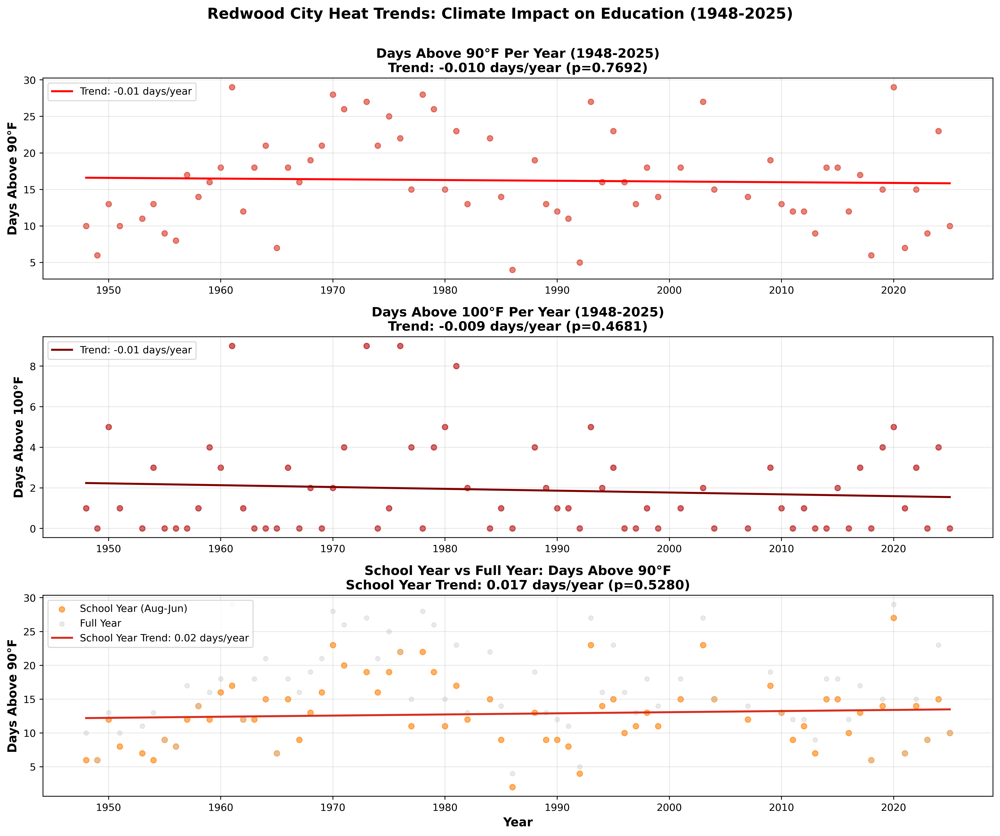
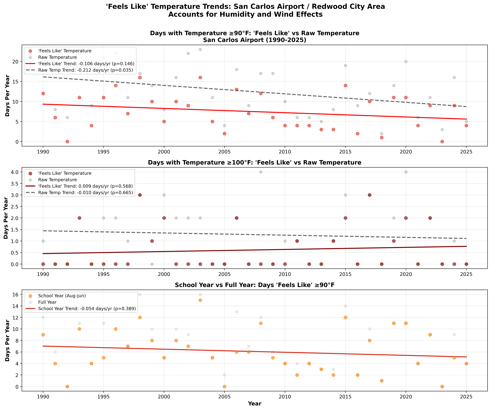
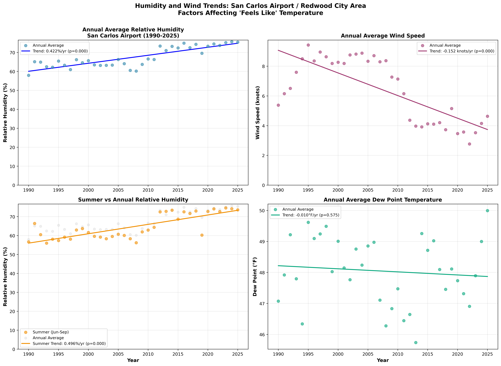

# Redwood City Temperature Extremes Visualization

A data visualization project that analyzes and visualizes daily temperature extremes (highs and lows) for Redwood City, California, using NOAA's Global Historical Climatology Network Daily (GHCN-D) dataset from 1948-2025.

## Overview

This project creates visualizations showing how temperature patterns have changed over 77 years. Analysis includes:

- **Historical Context**: All years from 1948 onwards plotted as faint gray lines
- **Recent Comparison**: The last 3 years highlighted in color
- **Daily Extremes**: Both daily high (TMAX) and daily low (TMIN) temperatures
- **Seasonal Patterns**: Month-by-month temperature variations
- **Heat Trend Analysis**: Days above 90°F and 100°F over time, with focus on educational impact
- **"Feels Like" Analysis**: Temperature trends accounting for humidity and wind effects (1990-2025)

## Key Findings

📊 **Temperature Data (1948-2025)**
- **Record High**: 109.9°F (September 2022)
- **Record Low**: 8.1°F (January 1995)
- **Mean High**: 71.2°F
- **Mean Low**: 47.6°F
- **Total Records**: 51,446 daily observations

🔥 **Heat Trend Analysis**
- **Days above 90°F**: No significant trend over 77 years (p=0.77)
  - Historical average (1948-1970): 15.2 days/year
  - Recent decade average: 14.6 days/year
- **Days above 100°F**: No significant trend (p=0.47)
  - Historical average: 1.6 days/year
  - Recent decade average: 2.0 days/year

**Educational Context**: While global warming is real, Redwood City's coastal location and marine influence appear to moderate extreme heat. The data shows no statistically significant increase in extreme heat days that would disrupt education, though individual years (like 2024 with 23 days >90°F) can still present challenges.

🌡️ **"Feels Like" Temperature Analysis (1990-2025)**

When accounting for humidity and wind effects using data from San Carlos Airport:
- **Days "feels like" ≥90°F**: Decreasing trend of -0.106 days/year (p=0.15)
  - Early period average (1990-2000): 8.7 days/year
  - Recent decade average: 6.8 days/year
- **Days raw temperature ≥90°F**: Significant decreasing trend of -0.212 days/year (p=0.035)
  - Early period average: 14.5 days/year
  - Recent decade average: 10.6 days/year
- **Days "feels like" ≥100°F**: No significant trend (+0.009 days/year, p=0.57)

**Key Insight**: When humidity and wind are factored into the analysis, the cooling trend becomes even more apparent. The area has experienced fewer extreme heat days in recent years when accounting for how the temperature actually feels, suggesting improved comfort conditions rather than worsening heat stress.

💨 **Humidity and Wind Trends (1990-2025)**

Analysis of the meteorological factors that affect "feels like" temperature reveals **highly significant changes**:

- **Humidity is INCREASING**: +0.422%/year (p<0.0001) - **statistically significant**
  - Early period average (1990-2000): 63.5%
  - Recent decade average: 73.8%
  - **Net change**: ~10 percentage points increase over 35 years

- **Summer humidity is INCREASING**: +0.496%/year (p<0.0001) - **statistically significant**
  - Early period average: 60.1%
  - Recent decade average: 71.6%

- **Wind speed is DECREASING**: -0.152 knots/year (p<0.0001) - **statistically significant**
  - Early period average: 7.8 knots
  - Recent decade average: 3.9 knots
  - **Net change**: ~50% reduction in wind speed

- **Dew point is stable**: -0.010°F/year (p=0.57) - no significant trend

**Critical Insight**: Higher humidity and lower wind speeds typically make hot days feel HOTTER. Yet the area is experiencing FEWER extreme heat days. This paradox reveals that the marine layer's cooling effect and overall temperature moderation are more than compensating for the humidity/wind changes. The microclimate is becoming more humid and calm, but also consistently cooler on extreme heat days.

## Visualizations

### Daily Temperature Extremes (1948-2025)


### Heat Days Trend Analysis


### "Feels Like" Temperature Trends (with Humidity & Wind)


### Humidity and Wind Trends


## Requirements

- macOS (or Linux with minor modifications)
- Python 3.8 or later
- NOAA NCEI API token (free, see setup below)
- `make` (usually pre-installed on macOS)

## Quick Start

### Option 1: Using Committed Data (No API Token Needed)

The repository includes pre-processed temperature data, so you can regenerate visualizations without fetching from NOAA:

```bash
# Clone the repository
git clone https://github.com/dweekly/rcsd-temps.git
cd rcsd-temps

# Set up virtual environment and install dependencies
make setup

# Generate visualizations using committed data
make visualize-only
```

This will regenerate all visualizations in the `figures/` directory using the committed processed data.

### Option 2: Fetch Fresh Data from NOAA

To download the latest temperature data:

#### 1. Get a NOAA API Token

1. Visit [NOAA NCEI's token request page](https://www.ncdc.noaa.gov/cdo-web/token)
2. Enter your email address
3. Check your email for the token (arrives within minutes)

#### 2. Clone and Setup

```bash
# Clone the repository
git clone https://github.com/dweekly/rcsd-temps.git
cd rcsd-temps

# Create .env file with your token
echo "NOAA_TOKEN=your-token-here" > .env

# Set up virtual environment and install dependencies
make setup
```

#### 3. Run the Full Pipeline

```bash
# Run the entire temperature pipeline (fetch, process, visualize, analyze)
make all

# Or run everything including 'feels like' analysis (takes ~7 minutes)
make all-feels-like
```

The basic pipeline will:
1. Download temperature data from NOAA (1948 to present)
2. Process and normalize the data
3. Generate temperature extremes visualization
4. Analyze heat trends (days above 90°F/100°F)

The extended pipeline (`all-feels-like`) also:
5. Fetches hourly ASOS data from San Carlos Airport (1990-2025)
6. Analyzes "feels like" temperatures accounting for humidity and wind
7. Analyzes humidity and wind trends over time

## Project Structure

```
rcsd-temps/
├── src/
│   ├── fetch_noaa.py            # Download data from NOAA API
│   ├── normalize.py             # Process and normalize data
│   ├── visualize.py             # Generate temperature extremes visualization
│   ├── analyze_heat_trends.py   # Analyze days above 90°F/100°F
│   ├── fetch_feels_like.py      # Download ASOS data for 'feels like' analysis
│   ├── analyze_feels_like.py    # Analyze 'feels like' temperature trends
│   └── analyze_humidity_wind.py # Analyze humidity and wind trends
├── data_raw/                    # Raw API responses (generated, not committed)
├── data_processed/              # Processed CSV files (committed for reuse)
├── figures/                     # Output visualizations (committed)
├── .env                         # API token (create this, not in git)
├── .env.example                 # Template for .env file
├── .gitignore                   # Excludes generated files and secrets
├── Makefile                     # Pipeline automation
├── requirements.txt             # Python dependencies
└── README.md                    # This file
```

**Note**: `data_processed/` and `figures/` are committed to the repository so users can regenerate visualizations without needing a NOAA API token.

## Detailed Usage

### Individual Pipeline Steps

You can run each step independently:

```bash
# Download data from NOAA (requires API token)
make fetch

# Process the downloaded data
make normalize

# Generate temperature extremes visualization
make visualize

# Analyze heat trends (days above 90°F/100°F)
make analyze

# Fetch ASOS data for 'feels like' analysis (~7 minutes)
make fetch-feels-like

# Analyze 'feels like' temperature trends
make analyze-feels-like

# Analyze humidity and wind trends
make analyze-humidity-wind

# Run all visualization steps using committed data (no API needed)
make visualize-only
```

### Cleaning Up

```bash
# Remove generated data and figures (keeps venv)
make clean

# Remove everything including virtual environment
make clean-all
```

### Help

```bash
# Show all available commands
make help
```

## How It Works

### 1. Data Fetching (`fetch_noaa.py`)

- Discovers the Redwood City weather station in NOAA's GHCN-D network
- Downloads all daily TMAX and TMIN records from ~1948 to present
- Caches raw API responses for reproducibility
- Outputs: `data_raw/all_daily_raw.csv`

### 2. Data Normalization (`normalize.py`)

- Converts temperatures from metric to Fahrenheit
- Removes February 29 (leap days) for consistent 365-day years
- Creates day-of-year aligned matrices suitable for visualization
- Performs data quality checks
- Outputs:
  - `data_processed/daily_clean.csv` - Tidy daily temperature data
  - `data_processed/tmax_matrix.csv` - Daily highs (365 days × N years)
  - `data_processed/tmin_matrix.csv` - Daily lows (365 days × N years)

### 3. Visualization (`visualize.py`)

- Loads processed temperature matrices
- Creates two-panel matplotlib figure
- Plots all historical years in gray
- Highlights recent years in color (orange/red for highs, blue for lows)
- Adds month labels, legends, and annotations
- Saves high-resolution outputs (PNG at 500 DPI, plus PDF and SVG)

### 4. Heat Trend Analysis (`analyze_heat_trends.py`)

- Loads processed daily temperature data
- Counts days per year above 90°F and 100°F thresholds
- Calculates school year statistics (August-June)
- Performs statistical trend analysis with linear regression
- Generates 3-panel visualization showing trends over time

### 5. "Feels Like" Data Fetching (`fetch_feels_like.py`)

- Fetches hourly ASOS data from San Carlos Airport (SQL station)
- Downloads temperature, humidity, dew point, and wind speed (1990-present)
- Uses Iowa Environmental Mesonet API
- Aggregates to daily statistics (max/min/mean)
- Outputs: `data_raw/asos_sql_daily.csv`

### 6. "Feels Like" Analysis (`analyze_feels_like.py`)

- Loads ASOS daily data with pre-calculated "feels like" temperatures
- Compares "feels like" vs raw temperature extremes
- Counts days above 90°F/100°F thresholds for both metrics
- Analyzes school year patterns
- Generates 3-panel comparison visualization

### 7. Humidity and Wind Analysis (`analyze_humidity_wind.py`)

- Loads ASOS daily data with humidity and wind measurements
- Calculates yearly averages for relative humidity, wind speed, and dew point
- Analyzes both annual and summer (Jun-Sep) patterns
- Performs statistical trend analysis with linear regression
- Generates 4-panel visualization showing humidity and wind trends
- Outputs: `data_processed/humidity_wind_by_year.csv`

## Data Sources

### Primary Temperature Data

**NOAA Global Historical Climatology Network Daily (GHCN-D)** dataset, accessed via the NCEI Climate Data Online (CDO) API v2:

- **Dataset**: GHCND
- **Station**: GHCND:USC00047339 (REDWOOD CITY, CA US)
  - Location: 37.4767°N, 122.2386°W, elevation 9.4m
  - Coverage: 1906-04-01 to present (using 1948+ for this analysis)
- **Parameters**: TMAX (daily maximum temperature), TMIN (daily minimum temperature)
- **Records**: 51,446 daily observations (1948-2025)
- **API Documentation**: https://www.ncdc.noaa.gov/cdo-web/webservices/v2

### "Feels Like" Temperature Data

**Iowa Environmental Mesonet ASOS archive** for San Carlos Airport:

- **Station**: SQL (San Carlos Airport, ~3.5 miles from Redwood City)
- **Location**: 37.51°N, 122.25°W
- **Coverage**: 1990-present
- **Parameters**: Temperature, dew point, relative humidity, wind speed, pre-calculated "feels like" temperature
- **Records**: 342,264 hourly observations (1990-2025)
- **API Documentation**: https://mesonet.agron.iastate.edu/request/download.phtml

## Customization

### Change the Number of Highlighted Years

Edit `src/visualize.py` and modify the `num_highlight` parameter in the `main()` function.

### Adjust Visual Styling

Colors, line widths, and other styling options can be modified in `src/visualize.py` in the `plot_panel()` function.

### Different Location

To analyze a different location, modify `src/fetch_noaa.py`:
- Change the `locationid` parameter to a different FIPS code
- Update the station search criteria

## Future Enhancements

- [ ] Support for any ZIP code or city name
- [ ] Interactive web-based visualizations (Plotly/Altair)
- [ ] Additional metrics (days above/below thresholds, trends)
- [ ] Automated monthly updates via GitHub Actions
- [ ] School-year specific analysis (Aug-Jun)
- [ ] Comparison with other Bay Area cities

## Contributing

Contributions are welcome! Please feel free to submit issues or pull requests.

## License

MIT License - feel free to use and modify for your own projects.

## Acknowledgments

- NOAA National Centers for Environmental Information for providing free access to climate data
- The GHCN-D dataset maintainers for decades of careful temperature record keeping

## Contact

Created by [@dweekly](https://github.com/dweekly)

---

Made with ❤️ for the Redwood City community
